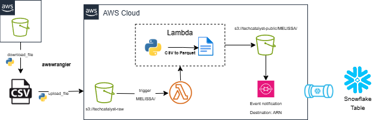

# Labs 1 --> 5 Final Report  
**Week 6**

In this lab, we covered topics ranging from awswrangler to lambda and even snowpipes! The first step would be to work with awswrangler within our codespace to download and upload files. However, there are many methods to achieve this so what are the differences?

**Differences** between uploading and downloading **methods** using **Boto3** library for **AWS S3**  

Uploading Files:  

**upload_file** [(link)](https://boto3.amazonaws.com/v1/documentation/api/latest/guide/s3-uploading-files.html) – Used to upload files and handles large files by splitting them into smaller chunks and uploading each chuck simultaneously.  
&nbsp;&nbsp;&nbsp;&nbsp;parameters: file name, bucket name, object name  
**upload_fileobj** [(link)](https://boto3.amazonaws.com/v1/documentation/api/latest/guide/s3-uploading-files.html) – This method accepts readable file-like object and it must be opened in binary mode not text mode.  
&nbsp;&nbsp;&nbsp;&nbsp;parameters: file name, bucket name, object name
Both are equal and usage is based on convenience

Downloading Files:  

**download_file** [(link)](https://boto3.amazonaws.com/v1/documentation/api/latest/guide/s3-example-download-file.html): This method accepts parameters on source bucket and file destination  
&nbsp;&nbsp;&nbsp;&nbsp;parameters: bucket name, object name, filename to save file to  
**download_fileobj** [(link)](https://boto3.amazonaws.com/v1/documentation/api/latest/guide/s3-example-download-file.html): In contrast, this one accepts a writable file-like object opened in binary mode NOT text mode.   
&nbsp;&nbsp;&nbsp;&nbsp;Same parameters as above  

Also like the upload methods, the download methods support the optional **ExtraArgs** and **Callback** parameters.
  

Put and Get Methods:  

**put_object** [(link)](https://boto3.amazonaws.com/v1/documentation/api/latest/reference/services/s3/client/put_object.html): Adds an object to a bucket  
&nbsp;&nbsp;&nbsp;&nbsp;parameters: more on the link  
**get_object** [(link)](https://boto3.amazonaws.com/v1/documentation/api/latest/reference/services/s3/client/get_object.html): returns an object from Amazon s3  
&nbsp;&nbsp;&nbsp;&nbsp;parameters: full key for the object (more on the link)  
  
| Method            | Purpose                                | Best Use Case                                      | Pros                                      | Cons                                           |
|-------------------|----------------------------------------|----------------------------------------------------|-------------------------------------------|------------------------------------------------|
| `upload_file`     | Upload a file from local to S3         | Uploading large files directly from local storage  | Multipart upload and works for large files | Only works with local files, not in-memory     |
| `upload_fileobj`  | Upload a file-like object              | Uploading logs or in-memory data                   | Allows uploads from memory                | Syntax is more complex                         |
| `put_object`      | Sends a file to S3 as a PUT request    | Best for small text or binary files. Quick uploads | Simple for small files and API data       | No multipart upload; not ideal for large files |
| `download_file`   | Downloads a file from S3 to local      | Downloading large S3 files                         | Multipart download; works for large files | Cannot process in-memory; saves to local       |
| `download_fileobj`| Downloads S3 object to file-like object| Writing an in-memory object                        | Lets you customize file handling          | Requires a file-like object                    |
| `get_object`      | Gets an object from S3                 | For previews or processing                         | Easy retrieval                             | Does not support multipart download            |

## Reflection Questions

### Upload Methods

**What are the key differences between `upload_file`, `upload_fileobj`, and `put_object`?**  
Between the upload methods, the main considerations are convenience and application.  
- Use `upload_file` for large files from local storage (supports multipart upload).  
- Use `upload_fileobj` for uploading file-like objects or in-memory data (also supports multipart upload).  
- Use `put_object` when uploading raw byte/string content in a single HTTP PUT request.

**When would you choose to use `put_object` over `upload_file` or `upload_fileobj`?**  
When uploading small files like logs or JSON configs directly from your code.

### Download Methods

**How does `download_file` differ from `download_fileobj` and `get_object`?**  
- `download_file` writes directly to a local file (supports multipart download).  
- `download_fileobj` writes to a file-like object (also supports multipart download).  
- `get_object` returns streamed access to content along with metadata and headers.

**In what scenarios would `get_object` be more beneficial than `download_file`?**  
When processing data in memory or previewing/validating content before saving.

### Efficiency and Performance

**How do multipart uploads and downloads enhance the performance of file transfer operations?**  
They split large files into smaller parts and upload/download them simultaneously. If a part fails, only that part is retried, not the entire operation.

**What are the limitations of using `put_object` and `get_object` for large files?**  
They rely on a single HTTP request. If any part fails, the whole operation fails. Best suited for small files.

### Practical Applications
**Consider a scenario where you need to upload a large video file to S3. Which method would you use and why?**  
Use `upload_file` since the video is large and stored locally.

**If you need to process data in memory before saving it locally, which download method would be most suitable?**  
Use `get_object` to stream the data in memory before saving.

---

## Lab 2

**Boto3 offers two APIs: Client API and Resource API**

- **What is the main difference between the two?**  
  - **Client API**: Used to interact with AWS services, retrieve data, and make requests.  
  - **Resource API**: Provides higher-level abstractions and is built on top of the Client API to simplify interactions.

&nbsp;
&nbsp;
# Final End-To-End Solution Architecture Diagram




#### Boto3 Code For Downloading and Uploading:
```
s3_client.download_file(Bucket='techcatalyst-raw', 
                        Key= <directory/key.csv>, 
                        Filename= <Filename>)

s3_client.upload_file(Filename='test.csv', # local file name
                      Bucket='techcatalyst-raw', # the bucket target
                      Key='MELISSA/test.csv')
```
This code downloads the csv and then uploads the file to AWS s3. After this, it will trigger the Lambda function below:

#### Lambda function code  
```
import boto3
import awswrangler as wr
from urllib.parse import unquote_plus
import json

def lambda_handler(event, context):
    # Get the source bucket and object name from the Lambda event
    for record in event['Records']:
        source_bucket = record['s3']['bucket']['name']
        source_key = unquote_plus(record['s3']['object']['key'])
    
    print(f'Bucket: {source_bucket}')
    print(f'Key: {source_key}')
    
    input_path = f"s3://{source_bucket}/{source_key}"
    print(f'Input Path: {input_path}')
    
    # Define the destination bucket and key
    destination_bucket = "techcatalyst-public"  # Target bucket name as a string
    
    # Derive the output key (keep same folder structure, replace file extension with .parquet)
    if source_key.lower().endswith('.csv'):
        output_key = source_key[:-4] + ".parquet"
    else:
        output_key = source_key + ".parquet"
        
    output_path = f"s3://{destination_bucket}/{output_key}"
    print(f'Output Path: {output_path}')
    
    # Read the CSV file from S3
    try:
        input_df = wr.s3.read_csv(path=input_path)
    except Exception as e:
        print("error on read")
        print(e)
        return {
            'statusCode': 500,
            'body': json.dumps('Error reading source CSV file')
        }
    
    # Write the DataFrame to Parquet format in the destination S3 bucket
    result = wr.s3.to_parquet(
        df=input_df,
        path=output_path
    )
    
    print("RESULT: ")
    print(result)
    
    return {
        'statusCode': 200,
        'body': json.dumps('CSV file converted to Parquet and moved successfully!')
    }
```
This code will convert the csv into parquet file format and write it to the destination s3 bucket. This will trigger our event notification connected via ARN to our snowpipe in Snowflake. Using the following code, we created a pipe to recieve the data from AWS SQS.
#### Snowflake Pipe Creation
```
create or replace pipe TECHCATALYST.EXTERNAL_STAGE.MELISSA_PIPE
auto_ingest = True
as 
copy into techcatalyst.MELISSA.temp
from  @TECHCATALYST.EXTERNAL_STAGE.MELISSA_AWS_STAGE
FILE_FORMAT = (format_name = 'MELISSA.parquet_format')
match_by_column_name = case_insensitive;
```
---
## Use Cases
- To read or store raw data from S3 and tranform into usable format 
- Automating data pipelines for incrementing data preprocessing, normalization, and to improve analysis.  


For example, a team within the Hartford has daily performance records in S3, we can help transform those records into workable formats.